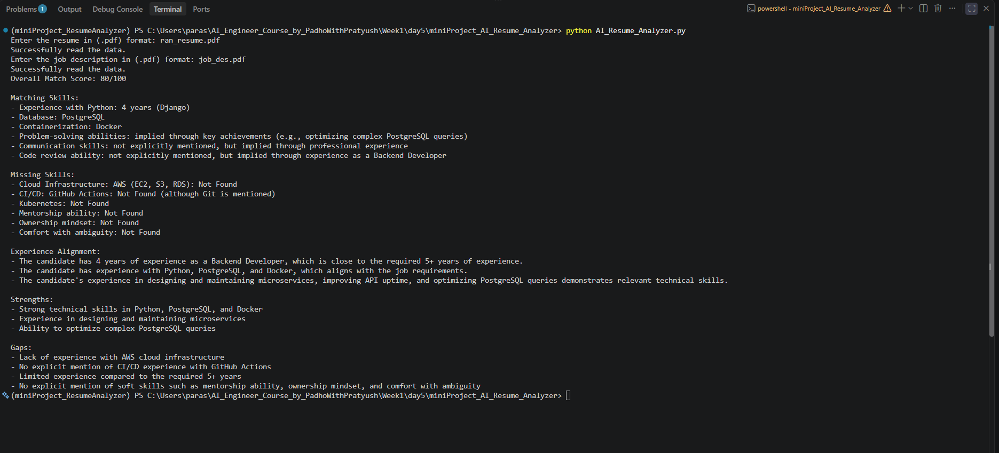

# 🤖 AI Engineering Journey

> A hands-on journey from **LLM fundamentals to RAG systems, vector databases, and AI agents** — documenting what I learn, build, experiment with, and understand along the way.

[](https://www.python.org/)
[](https://groq.com/)
[](https://qdrant.tech/)
[](https://www.sbert.net/)
[](https://www.langchain.com/)
[](https://tavily.com/)
[](https://docs.astral.sh/uv/)

---

## 📌 About This Repository

This repository documents my **AI Engineering learning journey** through hands-on coding, experiments, and small projects.

Instead of only studying theory, I am following a **build-as-I-learn approach**:

```text
LLM Fundamentals
       ↓
Prompt Engineering
       ↓
LLM Workflows
       ↓
RAG Fundamentals
       ↓
Embeddings
       ↓
Vector Databases
       ↓
Metadata Filtering
       ↓
Chunking
       ↓
RAG Evaluation
       ↓
AI Agents + Tools
       ↓
More Advanced AI Engineering
```

Every week contains practical implementations that help me understand how modern AI applications are actually built.

---

# 🗺️ Learning Roadmap

| Week      | Focus                                 | Status      |
| --------- | ------------------------------------- | ----------- |
| 🟢 Week 1 | LLM Fundamentals + AI Resume Analyzer | Completed   |
| 🟢 Week 2 | Prompt Engineering + LLM Workflows    | Completed   |
| 🟢 Week 3 | RAG + Embeddings + Qdrant             | Completed   |
| 🟢 Week 4 | Chunking + RAG Evaluation + AI Agents | Completed   |
| 🔵 Next   | Advanced RAG, Agents, Production AI   | In Progress |

---

# 📚 What I'm Learning

## 1. 🧠 LLM Fundamentals

The journey started with understanding the basic building blocks behind LLM-powered applications.

### Topics

* Python environment setup
* Virtual environments
* API keys and environment variables
* LLM API calls
* Model selection
* System / User / Assistant roles
* Temperature
* Tokens
* JSON
* Pydantic
* Structured outputs

### Practical Work

The early experiments focus on making LLM API calls and understanding how prompts, models, parameters, and responses work.

📁 `Week1/day1` → `Week1/day4`

---

# 2. 📄 AI Resume Analyzer

My first practical AI mini-project is an **LLM-powered Resume Analyzer**.

The application analyzes a candidate's resume against a job description and produces an ATS-style evaluation.

### Features

* 📄 Extract text from PDF resumes
* 📋 Extract job requirements
* 🤖 Analyze resume using an LLM
* 📊 Generate an ATS-style match score
* ✅ Identify matching skills
* ❌ Identify missing skills
* 💡 Highlight strengths and gaps

### Workflow

```text
Resume PDF
    │
    ▼
PDF Text Extraction
    │
    ▼
Candidate Information
    │
    ├───────────────┐
    │               │
    ▼               ▼
Resume Data     Job Description
    │               │
    └───────┬───────┘
            ▼
       LLM Analysis
            │
            ▼
     ATS-style Report
```

### Technologies

* Python
* Groq API
* Llama-based LLM
* PyPDF
* Prompt Engineering
* Environment Variables

### Demo



📁 Project:

`Week1/day5/miniProject_AI_Resume_Analyzer`

---

# 3. ✍️ Prompt Engineering

After learning the basics of LLM APIs, I started experimenting with **prompt engineering**.

### Concepts

* System prompts
* User prompts
* Instruction design
* Role-based prompting
* Output constraints
* Prompt-based extraction
* Prompt-based comparison

📁 `Week2/day6`

---

# 4. 🔄 ReAct & AI Reasoning Loops

I implemented a simple **ReAct-style AI agent** to understand how an LLM can reason through a task and interact with tools.

The basic workflow is:

```text
User Question
      ↓
     LLM
      ↓
   Thought
      ↓
   Action
      ↓
    Tool
      ↓
 Observation
      ↓
     LLM
      ↓
 Final Answer
```

The implementation explores the idea of combining:

* Reasoning
* Actions
* Tools
* Observations
* Iterative LLM calls

📁 `Week2/day7`

---

# 5. 🔗 Prompt Chaining

I explored how a complex AI task can be divided into multiple smaller LLM calls.

For example, the resume/JD matching workflow can be separated into:

```text
Resume
   ↓
Extract Candidate Skills
   ↓
Extract Job Skills
   ↓
Compare Skills
   ↓
Generate Match Score
```

This demonstrates how multiple prompts can be combined into a larger AI workflow.

📁 `Week2/day8`

---

# 6. ⚡ Streaming LLM Responses

I also experimented with **streaming responses** from an LLM instead of waiting for the entire response before displaying it.

```text
LLM
 ↓
Token / Chunk
 ↓
Display immediately
 ↓
Next Chunk
 ↓
Display
 ↓
...
```

This is important for building responsive AI interfaces such as chat applications.

📁 `Week2/day9`

---

# 7. 🔎 Retrieval-Augmented Generation (RAG)

Week 3 introduced one of the most important concepts in modern AI applications:

> **Retrieval-Augmented Generation (RAG)**

Instead of asking the LLM to answer entirely from its internal knowledge, relevant information is retrieved first and then supplied as context.

### Basic RAG Pipeline

```text
User Question
      ↓
Retrieve Relevant Information
      ↓
Context
      ↓
LLM
      ↓
Grounded Answer
```

I first implemented a simple keyword-based retrieval system to understand the core idea.

📁 `Week3/day11`

---

# 8. 🧮 Embeddings & Semantic Similarity

I then moved from keyword matching to **semantic search using embeddings**.

Using:

`all-MiniLM-L6-v2`

text is converted into numerical vectors.

```text
Text
 ↓
Embedding Model
 ↓
Vector
```

Two vectors can then be compared using **cosine similarity**.

```text
Text A ──→ Vector A
               │
               ├── Cosine Similarity
               │
Text B ──→ Vector B
```

This allows the system to find text that is semantically similar even when the exact words are different.

📁 `Week3/day12`

---

# 9. 🧠 Full RAG Pipeline

I combined embeddings, similarity search, and an LLM into a complete local RAG workflow.

### Pipeline

```text
Knowledge Documents
        ↓
Generate Embeddings
        ↓
Store Vectors
        ↓
User Query
        ↓
Query Embedding
        ↓
Similarity Search
        ↓
Relevant Context
        ↓
Groq LLM
        ↓
Answer
```

This implementation helped me understand why vector databases become useful when the knowledge base grows.

📁 `Week3/day13`

---

# 10. 🗄️ Qdrant Vector Database

After implementing similarity search manually, I moved to **Qdrant** as a vector database.

### Technologies

* Qdrant Cloud
* Sentence Transformers
* `all-MiniLM-L6-v2`
* Groq
* Python
* NumPy

The embedding model produces **384-dimensional vectors**, which are stored and searched inside Qdrant.

### Qdrant Workflow

```text
Documents
    ↓
SentenceTransformer
    ↓
384-D Embeddings
    ↓
Qdrant Collection
    ↓
Vector Search
    ↓
Relevant Documents
    ↓
Groq LLM
```

📁 `Week3/day14`

---

# 11. 🎯 Metadata Filtering

I extended the Qdrant implementation to explore **metadata filtering**.

Documents contain additional payload information such as categories.

This makes it possible to combine:

```text
Semantic Similarity
        +
Metadata Filtering
        ↓
More Relevant Retrieval
```

The implementation also explores creating a payload index and applying filters during vector search.

📁 `Week3/day15`

---

# 12. 🧩 RAG Concepts & Vector Search Notes

The repository also contains notes covering concepts related to:

* Qdrant filtering
* HNSW
* Vector search
* Retrieval behavior

📁 `Week3/day16/Filter_and_HNSW.txt`

---

# 13. ✂️ Text Chunking

Before storing large documents in a vector database, documents need to be split into manageable pieces.

I experimented with different chunking strategies using **LangChain Text Splitters**.

### Techniques Explored

#### Fixed-size chunking

```text
Document
   ↓
Chunk 1
Chunk 2
Chunk 3
...
```

#### Paragraph-based chunking

```text
Paragraph 1
Paragraph 2
Paragraph 3
```

#### Recursive chunking

Recursive splitting attempts to preserve meaningful text boundaries while respecting chunk size and overlap.

Example configuration:

```text
Chunk Size: 100
Overlap:    20
```

📁 `Week4/day17`

---

# 14. 📊 RAG Evaluation

I continued experimenting with the RAG pipeline by working on a **RAG evaluation setup**.

The implementation combines:

* Qdrant
* Sentence Transformers
* Groq
* Knowledge documents
* Metadata indexing
* Vector retrieval

The goal is to move beyond simply building RAG and start thinking about **how retrieval quality and generated answers can be evaluated**.

📁 `Week4/day18`

---

# 15. 🤖 AI Agents & Tool Calling

The latest part of the journey focuses on **AI agents that can use external tools**.

I implemented an agent using:

* Groq
* Tavily
* Python
* Tool calling
* Environment variables

### Tools

The current agent demonstrates two tools:

#### 🌐 Web Search

Uses Tavily to retrieve up-to-date information from the web.

#### 🧮 Calculator

A calculator implemented using Python's `ast` module rather than unrestricted `eval()`.

Supported operations include:

```text
+
-
*
/
//
%
**
```

### Agent Workflow

```text
                 ┌──────────────┐
                 │ User Query  │
                 └──────┬───────┘
                        ↓
                 ┌──────────────┐
                 │     LLM      │
                 └──────┬───────┘
                        ↓
                 Need a Tool?
                   /         \
                 Yes          No
                  ↓            ↓
            Select Tool    Final Answer
                  ↓
            Execute Tool
                  ↓
              Observation
                  ↓
                  LLM
                  ↓
            Final Answer
```

This is an important step toward understanding how modern AI agents interact with external systems.

📁 `Week4/day19`

---

# 🛠️ Technology Stack

| Technology                  | Purpose                               |
| --------------------------- | ------------------------------------- |
| 🐍 Python                   | Core programming language             |
| 🤖 Groq                     | LLM API                               |
| 🧠 Sentence Transformers    | Text embeddings                       |
| 🗄️ Qdrant                  | Vector database                       |
| 🔎 NumPy                    | Similarity calculations               |
| 🔗 LangChain Text Splitters | Document chunking                     |
| 🌐 Tavily                   | Web search for AI agents              |
| 📦 uv                       | Python package/environment management |
| 🔐 python-dotenv            | Environment variable management       |
| 📄 PyPDF                    | PDF text extraction                   |
| 📋 Pydantic                 | Data validation / structured data     |

---

# 📂 Repository Structure

```text
AI-Engineering-Journey/
│
├── Week1/
│   │
│   ├── day1/
│   │   ├── hello_llm.py
│   │   ├── main.py
│   │   └── pyproject.toml
│   │
│   ├── day2/
│   │   ├── main.py
│   │   └── sys_temp.py
│   │
│   ├── day3/
│   │   ├── main.py
│   │   └── tokens.py
│   │
│   ├── day4/
│   │   ├── main.py
│   │   └── jsn_pydantic.py
│   │
│   └── day5/
│       └── miniProject_AI_Resume_Analyzer/
│
├── Week2/
│   │
│   ├── day6/
│   │   └── prompt_engg.py
│   │
│   ├── day7/
│   │   └── react_chain.py
│   │
│   ├── day8/
│   │   └── prompt_chain.py
│   │
│   └── day9/
│       └── streaming.py
│
├── Week3/
│   │
│   ├── day11/
│   │   └── rag_intro.py
│   │
│   ├── day12/
│   │   └── embed_rag.py
│   │
│   ├── day13/
│   │   └── full_rag.py
│   │
│   ├── day14/
│   │   └── qdrant_day14.py
│   │
│   ├── day15/
│   │   └── quadrant_full.py
│   │
│   └── day16/
│       └── Filter_and_HNSW.txt
│
├── Week4/
│   │
│   ├── day17/
│   │   └── chunking.py
│   │
│   ├── day18/
│   │   └── rag_eval.py
│   │
│   └── day19/
│       └── agent_using_claude.py
│
└── README.md
```

> Some directories also contain their own `pyproject.toml`, `uv.lock`, `.python-version`, knowledge files, and supporting resources.

---

# ⚙️ Getting Started

## Prerequisites

Make sure you have:

* Python 3.14+
* `uv` installed
* Git
* Required API keys for the examples you want to run

---

## Clone the Repository

```bash
git clone https://github.com/paras907/AI-Engineering-Journey.git

cd AI-Engineering-Journey
```

---

# 🔐 Environment Variables

Several projects use environment variables for API credentials.

Create a `.env` file where required.

Example:

```env
GROQ_API_KEY=your_groq_api_key
QDRANT_URL=your_qdrant_url
QDRANT_API_KEY=your_qdrant_api_key
TAVILY_API_KEY=your_tavily_api_key
```

> Never commit your real API keys to GitHub.

---

# 📦 Using `uv`

The individual learning projects contain their own `pyproject.toml` and `uv.lock` files.

For a particular day:

```bash
cd Week1/day1
```

Create/sync the environment using the project's configuration:

```bash
uv sync
```

Then run the relevant Python file:

```bash
uv run python main.py
```

The exact script varies by day. For example:

```bash
uv run python prompt_engg.py
```

or:

```bash
uv run python streaming.py
```

---

# 📈 Learning Progress

```text
LLM Fundamentals       ████████████████████ 100%
Prompt Engineering    ████████████████████ 100%
ReAct                  ████████████████████ 100%
Prompt Chaining        ████████████████████ 100%
Streaming              ████████████████████ 100%
RAG Fundamentals       ████████████████████ 100%
Embeddings             ████████████████████ 100%
Qdrant                 ████████████████████ 100%
Filtering              ████████████████████ 100%
Chunking               ████████████████████ 100%
RAG Evaluation         ████████████████████ 100%
AI Agents              ████████████████████ 100%
```

### Current Direction

```text
                  AI ENGINEERING
                       │
        ┌──────────────┼──────────────┐
        ↓              ↓              ↓
       RAG           Agents          LLMs
        │              │              │
     Qdrant        Tool Calling    Prompting
     Chunking      Web Search      Structured Output
     Retrieval     Calculators     Model APIs
     Evaluation    Reasoning       Streaming
```

---

# 🎯 Goals

The long-term goal of this journey is to become capable of building **real-world AI-powered applications**, not just experimenting with individual LLM prompts.

Areas I want to continue exploring include:

* Advanced RAG
* Better retrieval strategies
* RAG evaluation
* Agent architectures
* Tool calling
* Multi-agent systems
* Structured outputs
* Production AI applications
* AI application deployment
* LLM observability
* AI security
* End-to-end AI projects

---

# 🧪 Philosophy

This repository is intentionally **hands-on**.

For every concept, the goal is:

```text
Learn
  ↓
Understand
  ↓
Implement
  ↓
Experiment
  ↓
Break Things
  ↓
Debug
  ↓
Build Something
  ↓
Move to the Next Concept
```

The code may evolve over time as my understanding improves.

---

# 📌 Projects

## 🤖 AI Resume Analyzer

**Location:**

```text
Week1/day5/miniProject_AI_Resume_Analyzer
```

An LLM-powered application that compares a resume with a job description and produces an ATS-style analysis.

---

# 🚀 What's Next?

The journey continues from foundational AI application development toward **more advanced and production-oriented AI Engineering**.

The focus will increasingly shift from:

> "How do I call an LLM?"

to:

> "How do I design, build, evaluate, secure, and deploy reliable AI systems?"

---

# 👨‍💻 About Me

**Paras Bansal**

Computer Science student exploring:

* Software Development
* Artificial Intelligence
* Machine Learning
* Generative AI
* AI Engineering

I'm documenting the journey publicly through code, experiments, and projects.

---

## ⭐ Follow the Journey

If you find this repository useful or interesting, consider giving it a ⭐ on GitHub.

**Repository:**
https://github.com/paras907/AI-Engineering-Journey

---

> 🚀 **Learning AI by building AI.**
